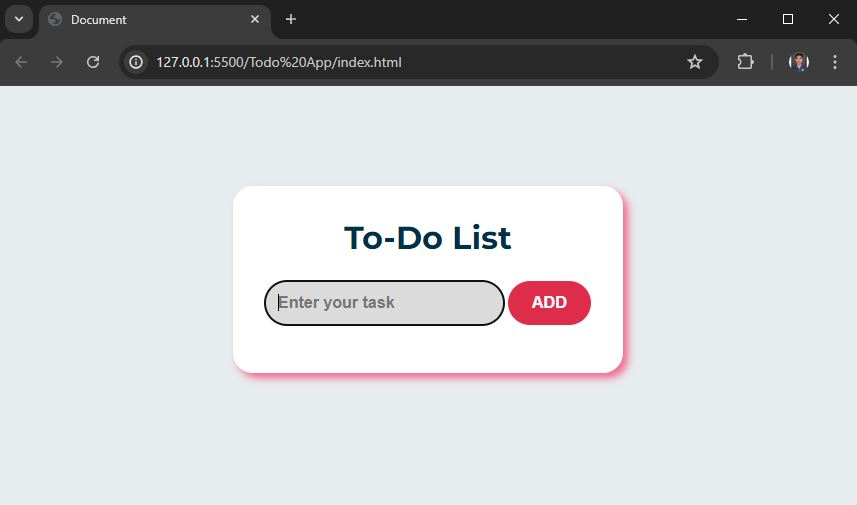
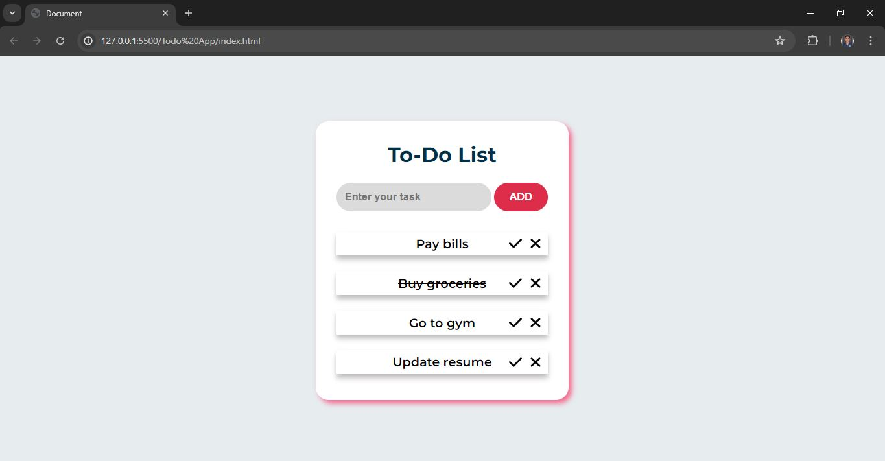
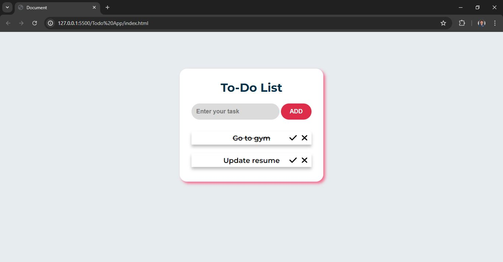
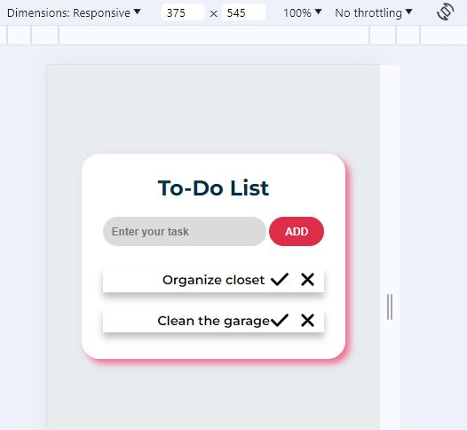

```markdown
# To-Do List Web Application

A simple web-based To-Do List application built using HTML, CSS and JavaScript. This application allows users to add tasks, mark them as completed, and delete tasks when necessary.






## Features

- **Add Task**: Users can enter a task in the input field and click the "ADD" button to add it to the list.
- **Mark as Completed**: Tasks can be marked as completed by clicking the checkmark icon next to each task. Completed tasks are visually distinguished with a strikethrough.
- **Delete Task**: Tasks can be deleted by clicking the delete icon (`x`) next to each task.
- **Responsive Design**: The application is designed to be responsive, adjusting to different screen sizes using CSS media queries.

## Learnings

In this To-Do List web application, I've utilized several features of JavaScript to make it interactive and functional. Here are the main JavaScript features and concepts I've employed:

1. **DOM Manipulation**:
   - **Document.querySelector**: Used to select elements from the DOM (Document Object Model) based on CSS selectors (`input`, `button`, `ol`).
   - **createElement**: Created new HTML elements (`li`, `img`) dynamically in response to user actions (adding tasks).

2. **Event Handling**:
   - **addEventListener**: Attached event listeners to elements like the "ADD" button and dynamically created check and delete buttons (`img` elements) to handle user interactions (click events).
   - **Event Object**: Utilized the event object (`event`) to determine which element triggered the event and perform appropriate actions (deleting or marking tasks).

3. **Conditional Statements**:
   - **if...else**: Used conditional statements to check if the task input field is empty before adding a new task (`if (taskInput.value !== "")`).

4. **String Manipulation**:
   - **innerText**: Set the text content of new `li` elements to display the task entered by the user (`task.innerText = taskInput.value`).

5. **CSS Manipulation**:
   - **classList.add**: Added classes (`check` and `delete`) to dynamically created `img` elements for styling purposes.

6. **Event Delegation**:
   - **Event Bubbling**: Leveraged event bubbling to handle click events on dynamically created elements (`check` and `delete` buttons) through their parent (`taskList`). This reduces the number of event listeners needed and improves performance.

7. **Responsive Design (Media Queries)**:
   - **CSS Media Queries**: While not directly JavaScript, you used JavaScript to adjust the layout based on screen size (`@media` queries in CSS were set based on the width of the screen).

These JavaScript features together enable your To-Do List application to dynamically add tasks, mark tasks as completed, delete tasks, and maintain responsiveness across different devices. Each feature enhances the user experience by allowing them to interact with and manage their tasks effectively within the web application.

## Technologies Used

- **HTML**: Provides the structure and content of the web page.
- **CSS**: Styles the HTML elements for a visually appealing interface.
- **JavaScript**: Implements the functionality of adding, checking off, and deleting tasks dynamically.

## Setup Instructions

To run this application locally, follow these steps:

1. Clone the repository:
   ```bash
   git clone https://github.com/your-username/todo-list.git
   ```
   
2. Navigate into the project directory:
   ```bash
   cd todo-list
   ```

3. Open `index.html` in your web browser.

## Usage

- Enter a task in the input field and click "ADD" to add it to your To-Do List.
- Click the checkmark icon (`✓`) to mark a task as completed.
- Click the delete icon (`✗`) to delete a task from the list.

## Contributing

Contributions are welcome! If you find any bugs or have suggestions for improvement, please create an issue or fork the repository and submit a pull request.


## License

This project is licensed under the MIT License - see the LICENSE file for details.

## Acknowledgments

- Icons used for checkmark and delete buttons: Font Awesome (SVG icons included in `assets/` directory).

## Author

- Ratnesh Kshirsagar
- GitHub: [ratnesh1253](https://github.com/ratnesh1253)
- Contact: [email](mailto:ratneshkshirsagar1253@gmail.com)

```
